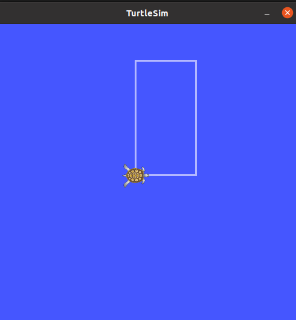

# About

This ROS Package can be used to control the movement of a bot inside the `turtlesim` package. It provides scripts to move the turtle in specific patterns, such as a straight line or a rectangle, with customizable parameters.

This repository is built upon [topguns837/ros_session](https://github.com/topguns837/ros_session).

<a href="https://youtu.be/QUYkIAd8WQs?si=rm1e0AzNei64N4pd" title="Link Title">Demonstration Video</a>

<div style="text-align: center;">
    
    
</div>

# Scripts
## `TurtleMover`
The `TurtleMover` class is a utility class that provides foundational methods and properties to control the turtle's movement.
This class is used by the other scripts as a base class to control the turtle's movement.

### Methods
1. `reset_turtlesim(duration:float=2)` - Resets/ Erases the turtlesim window after specified duration (in seconds).
2. `_publish_velocity(linear, angular)` - Publishes the velocity to the turtle.
3. `set_velocity(*, speed_twist_object:Twist=None, linear_x:float=None, linear_y:float=None, linear_z:float=None, angular_x:float=None, angular_y:float=None, angular_z:float=None)` - Sets the velocity of the turtle.
4. `get_axis_speed(axis:str = 'x')` - Returns the speed of the turtle in the specified axis.
5. `stop()` - Sets the velocity of the turtle to zero.
6. `move_for_duration(duration:float)` - Moves the turtle for the specified duration.
7. `rotate(angle:float (radian), clockwise:bool=False, angular_speed:float=1)` - Rotates the turtle by the specified angle in radians.
8. `move_straight(distance, axis:str='x')` - Moves the turtle in a straight line for the specified direction.
9. `print_speed()` - Prints the linear and angular speed of the turtle.
10. `get_to_coordinates(x:float, y:float)` - Moves the turtle to the specified coordinates.  **[Not Implemented Yet (Commented Out)]**
11. `__init__(linear_speed:tuple, angular_speed:tuple)` - Initializes the `TurtleMover` object with the specified linear and angular speeds by creating Vector3 objects.

## `move_straight.py`
Derived from the `TurtleMover` class, this script moves the turtle in a straight line with a specified distance.

### Arguments
1. **linear_speed** (tuple) (1.0, 0.0, 0.0) - The linear speed of the turtle. **[Not A CL Argument Yet]**
2. **angular_speed** (tuple) (0, 0, 0) - The angular speed of the turtle. **[Not A CL Argument Yet]**
3. **distance** (float) - The distance to move the turtle.
4. **axis** (str) - The axis along which to move the turtle. Default is 'x'.

```bash
rosrun ros_session move_straight.py 3 x   # Example
```

## `move_circle.py`
This script moves the turtle in a circular pattern with a specified radius and angular speed for a specified duration.

### Arguments
1. `radius` (float) - The radius of the circle.
2. `speed` (float) - The angular speed of the turtle along x axis.

```bash
rosrun ros_session move_circle.py 1 1    # Example
```

## `move_rect.py`

This script moves the turtle in a rectangular pattern with specified length and breadth.

### Arguments

1. **length** (float) - The length of the rectangle.
2. **breadth** (float) - The breadth of the rectangle.
3. **speed** (float) - The speed of the turtle.
4. **clockwise** (boolean) - True for clockwise, False for anticlockwise. Default is True.
5. **facing_direction** (str) - The direction in which the turtle should face initially. Default is 'w' (west). **[Not Implemented Yet]**

```bash
rosrun ros_session move_rect.py 3 2     # Example
```

This command makes the turtle move in a rectangle with a length of 3 units and a breadth of 2 units.

## `improved_rect.py`
This script moves the turtle in a rectangular pattern with specified length and breadth, the initial direction in radians, and the clockwise or anticlockwise direction.

### Arguments
1. **length** (float) - The length of the rectangle.
2. **breadth** (float) - The breadth of the rectangle.
3. **init_direction_radian** (float) - The initial direction of the turtle in radians.
4. **clockwise** (boolean) - True for clockwise, False for anticlockwise.

```bash
rosrun ros_session improved_rect.py 3 2 0 False     # Example
```

# Installation

- Install the `turtlesim` package:

    ```bash
    sudo apt-get install ros-noetic-turtlesim
    ```

- Fork the repository.
- Clone this package inside a catkin workspace:

    ```bash
    mkdir -p ros_ws/src 
    cd ros_ws/src
    git clone https://github.com/<your-username>/turtlesim-task.git
    ```

- Compile the code and source the workspace:

    ```bash
    catkin_make
    source devel/setup.bash
    ```

# Instructions to Run the Code

- **Step 1**: Open a new terminal and start the ROS master node:

    ```bash
    roscore
    ```

- **Step 2**: Open another terminal and launch the `turtlesim` node:

    ```bash
    rosrun turtlesim turtlesim_node
    ```

- **Step 3**: In a third terminal, check that all scripts are executable by running the following command. Executable scripts will have an `x` in the permissions column.

    ```bash
    ls -l src/ros_session/scripts/
    ```

- **Step 4**: Make non-executable scripts executable by running:

    ```bash
    chmod +x src/ros_session/scripts/<script_name>
    ```

- **Step 5**: Run the desired script to control the turtle's movement.
